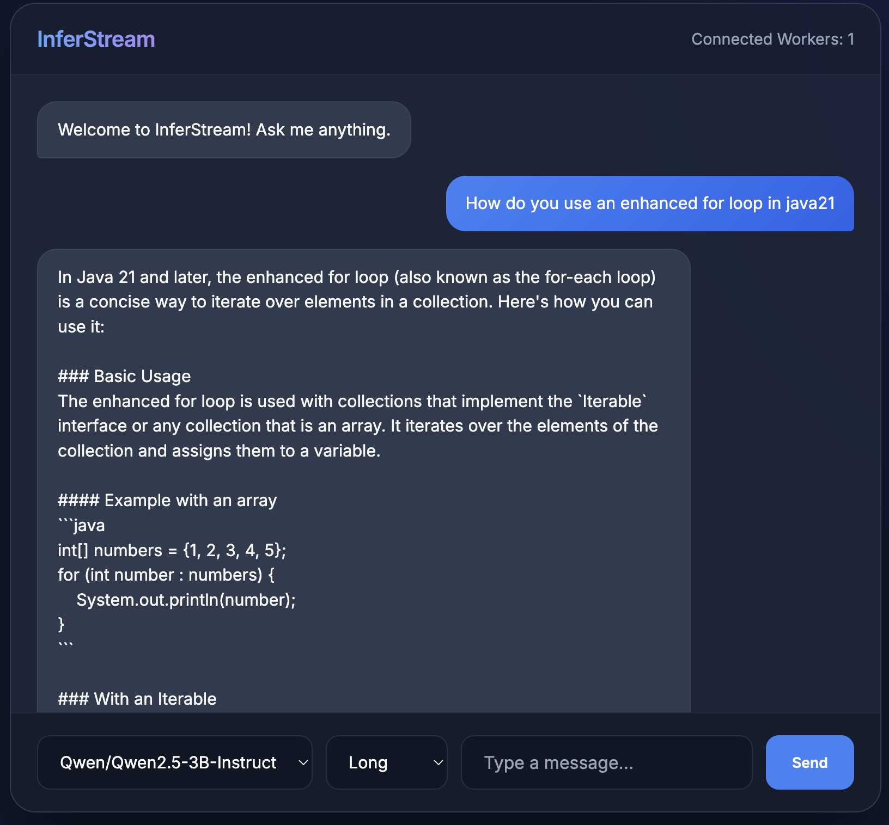

# InferStream

Building a distributed LLM inference system designed to run across local laptops and machines. The goal is to demonstrate distributed compute, request batching for efficiency, scalable inference throughput, and basic LLM serving concepts.



## Architecture

The system follows a simple distributed layout with an in-memory queue, avoiding the need for complex external brokers like Kafka or Redis.

It consists of three main components:
1. **Frontend UI**: A FastAPI web server hosting a beautiful, modern chat interface for users to submit inference tasks.
2. **Coordinator Service**: The central "brain" of the system. It handles incoming client requests, manages an in-memory queue grouped by task length (`SHORT`, `MEDIUM`, `LONG`), and distributes tasks to available workers via gRPC.
3. **Worker Nodes**: Distributed compute layers that load the model into memory (e.g., DistilGPT2 via Hugging Face), poll the coordinator for work, and run the PyTorch LLM generation loops.

## Layout

- `src/inferstream/` — installable package.
  - `coordinator/`: Central service logic and queueing.
  - `frontend/`: FastAPI web server and UI static assets.
  - `worker/`: Distributed compute node logic.
  - `inference/`: PyTorch LLM execution and KV-cache management.
  - `grpc/`: Generated Python stubs from `.proto` definitions.
  - `metrics/`: Generic metric registry for tracking throughput, latency, and memory.
- `proto/` — `.proto` sources; regenerate Python stubs with `./scripts/regenerate_proto.sh`.
- `tests/` — pytest suite and standalone local inference demo.

## Running the Distributed System

### Single Machine (local development)

Spin up the Coordinator and Frontend together with Ctrl+C support:
```bash
uv run inferstream-serve
```

Then start a worker in a separate terminal:
```bash
# Quick test with a tiny model (~300 MB)
uv run inferstream-worker --model distilgpt2 --max-ram-gb 2.0

# Small Qwen model
uv run inferstream-worker --model qwen2.5-0.5b --max-ram-gb 4.0

# Full Qwen 3B (default)
uv run inferstream-worker --model qwen2.5 --max-ram-gb 16.0
```

Once running, open `http://localhost:8000/` in your browser to interact with the UI.

### Running Across Multiple Machines (e.g. Raspberry Pi + MacBook)

You can run the lightweight Coordinator and Frontend on a low-power device like a Raspberry Pi, while running the heavy inference Worker on your MacBook.

1. **On the Raspberry Pi (Coordinator + Frontend)**:
   Ensure you have a 64-bit OS installed (like Raspberry Pi OS Lite 64-bit) to support Python dependencies.
   Use the combined launcher — **Ctrl+C tears both services down cleanly**:
   ```bash
   uv run inferstream-serve
   # or with explicit ports:
   uv run inferstream-serve --coordinator-port 50051 --frontend-port 8000
   ```
   *Both services bind to `0.0.0.0` by default, so they are accessible on your local network.*

2. **On your MacBook (Worker)**:
   Point the worker at the Pi using its IP address or mDNS hostname:
   ```bash
   # Using IP (most reliable)
   uv run inferstream-worker --coordinator 10.107.8.126:50051

   # Using mDNS hostname (also works — resolved automatically by InferStream)
   uv run inferstream-worker --coordinator pi.local:50051
   ```
   Full options example:
   ```bash
   uv run inferstream-worker \
       --coordinator pi.local:50051 \
       --model Qwen/Qwen2.5-0.5B-Instruct \
       --max-ram-gb 8.0 \
       --max-batch-size 8 \
       --max-seq-len 2048
   ```
   > **mDNS & gRPC**: `.local` hostnames use mDNS (Bonjour/Avahi) which gRPC's internal resolver does not support. InferStream automatically pre-resolves the hostname via the OS (which does support mDNS) before creating the gRPC channel, so both IPv4 and IPv6 results are handled correctly.

   *Note: For gated models (e.g. Llama 3.1), first run `uv run huggingface-cli login`.*

3. **Accessing the UI**:
   Open `http://pi.local:8000` in your MacBook's browser.

## CLI Reference

All commands are registered as package entry points and available via `uv run <command>`:

| Command | Description |
|---|---|
| `inferstream-serve` | Launch coordinator + frontend together (Ctrl+C stops both) |
| `inferstream-coordinator` | Start only the gRPC coordinator |
| `inferstream-frontend` | Start only the HTTP frontend |
| `inferstream-worker` | Start a worker node (connect to coordinator via `--coordinator`) |

### `inferstream-serve` options
| Flag | Default | Description |
|---|---|---|
| `--coordinator-port` | `50051` | gRPC port for the coordinator |
| `--frontend-port` | `8000` | HTTP port for the frontend UI |

### `inferstream-frontend` options
| Flag | Default | Description |
|---|---|---|
| `--coordinator` | `localhost:50051` | Coordinator address (also via `COORDINATOR_ADDR` env var) |
| `--port` | `8000` | HTTP port to listen on |

### `inferstream-worker` options
| Flag | Default | Description |
|---|---|---|
| `--coordinator` | `localhost:50051` | Coordinator address (supports IP, hostname, or mDNS `.local`) |
| `--model` | `qwen2.5` | Model alias or full Hugging Face ID (see table below) |
| `--list-models` | — | Print supported model aliases and exit |
| `--max-ram-gb` | `16.0` | RAM budget in GB (worker aborts if model + KV cache exceeds this) |
| `--max-batch-size` | `8` | Max concurrent inference slots |
| `--max-seq-len` | `2048` | Max sequence length per slot |

### Supported Models

| Alias | Full Model ID | Size | Use Case |
|---|---|---|---|
| `distilgpt2` | `distilgpt2` | ~300 MB | Fast local testing |
| `qwen2.5-0.5b` | `Qwen/Qwen2.5-0.5B-Instruct` | ~1 GB | Lightweight inference |
| `qwen2.5` | `Qwen/Qwen2.5-3B-Instruct` | ~6 GB | Default, general use |
| `llama3.2` | `meta-llama/Llama-3.2-3B-Instruct` | ~6 GB | Llama, gated ⚠️ |
| `llama3.1` | `meta-llama/Llama-3.1-8B-Instruct` | ~16 GB | Best Llama for 36GB RAM, gated ⚠️ |

> ⚠️ **Gated models** (Llama): Accept the license at [huggingface.co/meta-llama](https://huggingface.co/meta-llama), then run `uv run huggingface-cli login` before starting the worker.


You can also pass any full Hugging Face model ID directly to `--model`. Run `inferstream-worker --list-models` to print the alias table at any time.

## Performance / Load Testing

Once your coordinator and worker nodes are running, you can measure inference throughput (tokens/sec) and latency using the included load testing script.

To saturate the cluster and get your best tokens/sec performance:

1. **Calculate total slots**: Check your worker `--max-batch-size` setting. If you have two nodes with `100` max batch size each, you have `200` total slots.
2. **Send 1.5x - 2.0x requests**: Provide more concurrent requests than total slots to keep the continuous batching engine busy.

```bash
uv run python scripts/load_test.py --url http://localhost:8000 --requests 300 --length long --model llama3.1
```

*(Optional)* Pass `--count-tokens` to download the Hugging Face tokenizer for an exact token count instead of an estimation based on task length.

## Commands & Testing

You can run the core inference engine locally without starting the distributed servers:

```bash
uv sync --group dev             # install project + dev deps (pytest)
uv run pytest tests/test_demo.py -s  # run the local standalone inference demo
./scripts/regenerate_proto.sh   # compile protobufs to python stubs
```

## Publishing (PyPI)

Build artifacts land in `dist/` (gitignored). Upload requires a [PyPI API token](https://pypi.org/manage/account/token/):

```bash
uv build
UV_PUBLISH_TOKEN=<your-pypi-token> uv publish
```

On GitHub Actions you can use [trusted publishing](https://docs.pypi.org/trusted-publishers/) (OIDC) instead of a long-lived token.

## Observability & Metrics

The system has a built-in observability stack powered by **OpenTelemetry**. This allows you to track inference performance, token generation latency, KV cache size, and more.

You can configure metric exporters by setting the `INFERSTREAM_METRICS_EXPORTER` environment variable.

### Exporter Options:
- `inmemory` (Default): Stores metrics in process memory. Ideal for testing and single-process scripts.
- `console`: Prints out periodic metric updates directly to `stdout`.
- `otlp`: Forwards telemetry data over gRPC/HTTP directly to an OTEL collector.
- `prometheus`: Spins up a Prometheus scrape endpoint on the worker node.

### Visualizing with Prometheus & Grafana

To scrape and visualize worker metrics using Prometheus:

1. Start your worker node with the Prometheus exporter enabled:
   ```bash
   export INFERSTREAM_METRICS_EXPORTER=prometheus
   export PROMETHEUS_PORT=9090
   uv run inferstream-worker
   ```
2. Configure your **Prometheus server** (`prometheus.yml`) to scrape the worker node endpoint:
   ```yaml
   scrape_configs:
     - job_name: 'inferstream_worker'
       scrape_interval: 5s
       static_configs:
         - targets: ['localhost:9090']
   ```
3. Connect your Prometheus data source to **Grafana** to visualize core metrics such as:
   - `time_per_output_token_ms`: Token generation throughput latency.
   - `kv_cache_size_mb`: Memory utilization of the continuous batching engine.
   - `total_generated_tokens`: Total generated output volume.